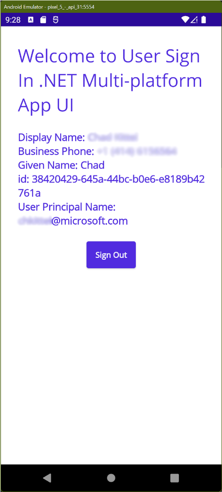

---
# Metadata required by https://docs.microsoft.com/samples/browse/
# Metadata properties: https://review.docs.microsoft.com/help/contribute/samples/process/onboarding?branch=main#add-metadata-to-readme
languages:
- csharp
page_type: sample
name: ".NET MAUI Multi-platform App Sign-in user"
description: "This is a .NET MAUI Multi-platform App Sign-in user that sign-in users. The code in this sample is used by one or more articles on docs.microsoft.com."
products:
- azure
- azure-active-directory
- ms-graph
urlFragment: ms-identity-docs-code-csharp
---
# .NET MAUI Multi-platform App - Sign-in user | Microsoft identity platform

<!-- Build badges here
  
-->

This sample demonstrates a .NET MAUI Multi-platform App that sign-in users by using the `Microsoft.Identity.Client`.


> :page_with_curl: This sample application backs one or more technical articles on docs.microsoft.com. <!-- TODO: Link to first tutorial in series when published. -->

## Prerequisites

- An Azure Active Directory (Azure AD) tenant. You can [open an Azure account for free](https://azure.microsoft.com/free) to get an Azure AD instance.
- [Visual Studio 2022 Preview](https://visualstudio.microsoft.com/vs/preview/#download-preview)
- [.NET 6.0 SDK](https://dotnet.microsoft.com/download/dotnet/6.0)
- [.NET MAUI](https://docs.microsoft.com/dotnet/maui/get-started/installation)

## Setup

### 1. Register the web API application in your Azure Active Directory

First, complete the steps in [Register an application with the Microsoft identity platform](https://docs.microsoft.com/azure/active-directory/develop/quickstart-register-app) to register the sample app.

Use the following settings for your app registration:

| App registration <br/> setting | Value for this sample app                                         | Notes                                                                                                       |
|-------------------------------:|:------------------------------------------------------------------|:------------------------------------------------------------------------------------------------------------|
| **Name**                       | `active-directory-dotnet-xplat-maui`                              | Suggested value for this sample. <br/> You can change the app name at any time.                             |
| **Supported account types**    | **My organization only**                                          | Required for this sample. <br/> Support for the Single tenant.                                              |
| **Platform type**              | `Mobile and desktop applications`                                 | Required value for this sample. <br/> Enables the required and optional settings for the app type.          |
| **Redirect URI**              | `https://login.microsoftonline.com/common/oauth2/nativeclient`    | Required value for this sample. <br/> You can change that later in your own implementation.                 |

> :information_source: **Bold text** in the table matches (or is similar to) a UI element in the Azure portal, while `code formatting` indicates a value you enter into a text box or select in the Azure portal.

<details>
   <summary>:computer: Alternative: Register the application using az-cli</summary>

1. Register a new Azure AD App with a reply url

   ```bash
   AZURE_AD_APP_CLIENT_ID_XPLAT=$(az ad app create --display-name "active-directory-dotnet-xplat-maui" --reply-urls "https://login.microsoftonline.com/common/oauth2/nativeclient" --native-app true --query appId -o tsv)
   ```

</details>

### 2. Configure the web app

1. Open the _sign-in-xplat/MainPage.xaml.cs_ in your code editor.

    ```csharp
    private const string ClientId = "APPLICATION_(CLIENT)_ID";
    private const string Tenant = "TENANT_ID";
    ```

## Run the application

### 1. Run the .NET MAUI App

1. Press `F5` and ensure you have selected `Windows Machine`
1. Once the app is running you can sign-in with your user credentials.



## About the code

This .NET MAUI Multi-platform App uses the Microsoft Identity Client library and presents a simple UI that will popup a separated window allowing the user to sign in into their Azure AD single tenant orgnizations.

When users sign in, a new token is acquired and passed in an Authorization header as Bearer for a subsequent call to Microsoft Graph Api endpoint `/me` using the Microsoft Graph library. After signing in, and if they've not previously done so, the user is asked to consent to the app's request for permission to access their data. Such data is going to be displayed in the UI.  When a signed-out user the account is removed from the client cleaning up users retrieved information.

## Reporting problems

### Sample app not working?

If you can't get the sample working, you've checked [Stack Overflow](http://stackoverflow.com/questions/tagged/msal), and you've already searched the issues in this sample's repository, open an issue report the problem.

1. Search the [GitHub issues](../../../../issues) in the repository - your problem might already have been reported or have an answer.
1. Nothing similar? [Open an issue](LINK_HERE) that clearly explains the problem you're having running the sample app.

### All other issues

> :warning: WARNING: Any issue _not_ limited to running this or another sample app will be closed without being addressed.

For all other requests, see [Support and help options for developers | Microsoft identity platform](https://docs.microsoft.com/azure/active-directory/develop/developer-support-help-options).

## Contributing

If you'd like to contribute to this sample, see [CONTRIBUTING.MD](/CONTRIBUTING.md).

This project has adopted the [Microsoft Open Source Code of Conduct](https://opensource.microsoft.com/codeofconduct/). For more information, see the [Code of Conduct FAQ](https://opensource.microsoft.com/codeofconduct/faq/) or contact [opencode@microsoft.com](mailto:opencode@microsoft.com) with any additional questions or comments.
